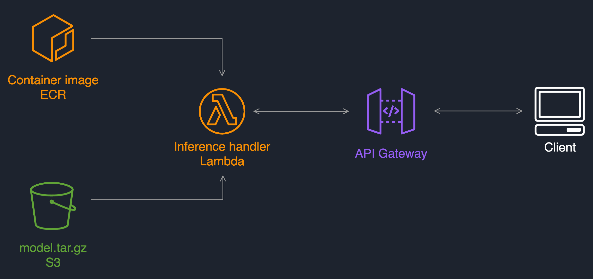

## MLOps for Lambda Endpoint Deployment

This is a sample code repository for demonstrating how you can organize your code for deploying an realtime inference Endpoint infrastructure. This code repository is created as part of creating a Project in SageMaker. 

This code repository has the code to find the latest approved ModelPackage for the associated ModelPackageGroup and, once the model approved, it automatically deploys it on a Lambda function exposed by an API Gateway. 

Upon triggering a deployment, the CodePipeline pipeline will deploy 2 API Gateway/Lambda pair - `staging` and `prod`. After the first deployment is completed, the CodePipeline waits for a manual approval step for promotion to the `prod` stage. You will need to go to CodePipeline AWS Managed Console to complete this step.

A description of some of the artifacts is provided below:

### Layout of the SageMaker ModelBuild Project Template

`buildspec.yml`
 - this file is used by the CodePipeline's Build stage to build a CloudFormation template.

`build.py`
 - this python file contains code to get the latest approve package arn and exports staging and configuration files. This is invoked from the Build stage.

`staging-config.json`
 - this configuration file is used to customize `staging` stage in the pipeline. 

`prod-config.json`
 - this configuration file is used to customize `prod` stage in the pipeline. 

`stack`
 - this folder holds the Infrastructure as Code for the staging and production environments. It's written in AWS CDK and Python. The infrastructure uses an Amazon API Gateway and an AWS Lambda: 

`test/buildspec.yml`
  - this file is used by the CodePipeline's `staging` stage to run the test code of the following python file

`test/test.py`
  - this python file contains code to describe and invoke the staging endpoint. You can customize to add more tests here.
